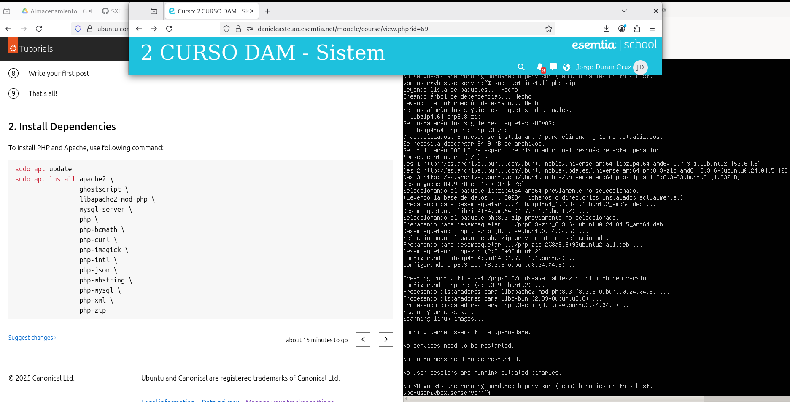

# SXE_Tarea2

## Actualizacion de repositorios:

Con el comando `apt update` actualizamos los repositorios desde donde se descargaran las dependencias para asegurar las versiones más recientes.

## Instalación de requisitos:

Despues de hacer el update instalamos todas las dependencias que se indican en la página de la izquierda usando el comando `apt install`. Pueden instalarse en la misma linea de comando o ir una por una.

