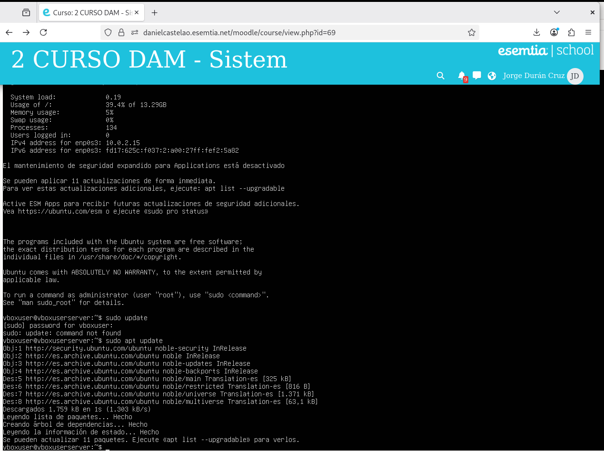

# SXE_Tarea2

## Actualizacion de repositorios:

Con el comando update actualizamos los repositorios desde donde se descargaran las dependencias para asegurar las versiones más recientes.

## Instalación de requisitos:

