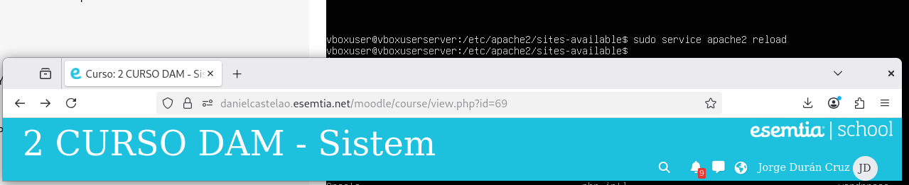
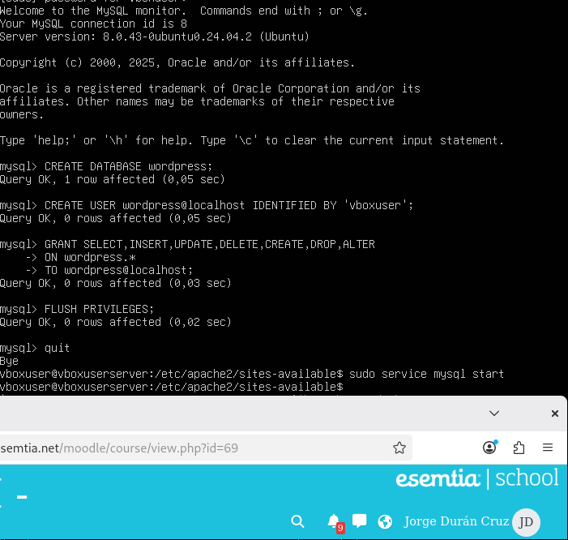

# SXE_Tarea2

## Actualizacion de repositorios:

Con el comando `apt update` actualizamos los repositorios desde donde se descargaran las dependencias para asegurar las versiones más recientes.

## Instalación de requisitos:

Despues de hacer el update instalamos todas las dependencias que se indican en la página de la izquierda usando el comando `apt install`. Pueden instalarse en la misma linea de comando o ir una por una.

## Instalación de wordpress

Ahora vaamos a instalar el servicio de wordpress. Para ello primero debemos crear una carpeta donde instalaremos wordpress con el comando `mkdir -p` seguido de la localización de la carpeta para que cree los directorios padre necesarios.

Una vez creada la carpeta con el comando `chown` le indicamos que la carpeta es propiedad del usuario www-data.

Por último con el comando `curl` descargamos desde el enlace de wordpress la version más reciente y agregamos `| tar` en la manera que se indica en la imagen para descomprimir el archivo y con la función `-C` elegir la carpeta creada antes como el lugar donde descomprimirlo.

## Configuración:

Con un comando de editor de texto, en este caso `nano`, creamos el archivo wordpress.conf en la ruta `/etc/apache2/sites-avaliable` y luego copiamos la configuración que aparece en la guía de la izquierda.

## Habilitar el servicio:

Con el comando `a2ensite worpress` habilitamos el servicio de wordpress.

## Recargar el servicio apache:

Ahora con el comando `service apache2 reload` recargamos el servicio de apache para aplicar la configuración de wordpress.

## Configurar la base de datos:

Con `mysql` entramos al gestor de bases de datos donde crearemos la base de datos de wordpress.

1. `create database wordpress` Para crear la base de datos.
2. `create user wordpress@localhost IDENTIFIED BY 'vboxuser''` Para crear al usuario que manejara la base de datos y que tenga la contraseña 'vboxuser'.
3. `grant select,insert,update,delete,create,drop,alter on wordpress.* to wordpress@localhost` Para darle todos los permisos necesarios de las tablas de la base wordpres al usuario que creamos antes.
4. `flush privileges` Para aplicar los cambios en los permisos.

